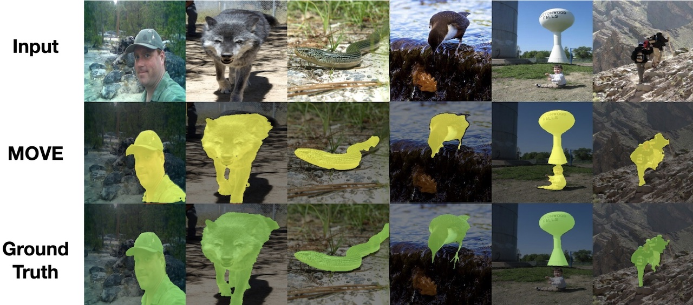

# MOVE: Unsupervised Movable Object Segmentation and Detection; NeurIPS 2022

Official code for MOVE: Unsupervised Movable Object Segmentation and Detection; NeurIPS 2022  
*Adam Bielski, Paolo Favaro*  
Link to the paper: https://arxiv.org/abs/2210.07920



# Getting Started
Install the dependencies in a new conda environment using the following command:
```
conda env create -f environment.yml
conda activate move
```

# Training
Prepare the dataset so it's complying with PyTorch's ImageFolder structure.  
The model used in paper was trained on [DUTS-TR](http://saliencydetection.net/duts/#org3aad434) dataset. To use it as PyTorch's ImageFolder dataset, you need to create a folder structure as follows:
```
DUTS-TR-Image
├── 0
│   ├── *image_files*
```
A similar structure should be used later for evaluation.

To train the model with default parameters, run the following command:
```
python train.py --data_path path-to-dataset --output_dir output-dir
```
Notable parameters:
- `--feature_extractor` - which features to use; tested with `dino_vits8` and `mae`
- `--shift_range` - range of random shift applied to the predicted foreground (default: 0.125 of image size)
- `--disc_real_input` - real inputs for training the discriminator; default: `real_ae,composed_noshift`
- `--disc_fake_input` - fake inputs for training the discriminator; default: `composed,real_ae_shift_cp`
- `--copy_real_in_inpainted` - the background will be composed from the real image in the predicted background region and the inpainted background part in the predicted foreground region (instead of using the entire inpainted output from MAE). Should be used with discriminator inputs without autoencoding: `--disc_real_input real,composed_noshift`. It's needed for no-gan MAE inpainter; we also found it makes the convergence faster overall.
- `--min_mask_area`, `--min_mask_alpha`, `--max_mask_area` `--max_mask_alpha`, `--bin_mask_alpha` - parameters for the mask losses; by default min_mask_area is set to 0.05, there's no constraint on the max area.
- `--precision 16` for faster training with mixed precision
  


# Inference
Download the model from [github](https://github.com/adambielski/move-seg/releases/tag/move_model ) and place it in the project's root directory.

Run the inference script on PyTorch's ImageFolder dataset with:
```
python infer.py --model_path <path_to_model> --data_path <path_to_data>
```
The script resizes each image so that the smaller side is 448 pixels and keeps the aspect ratio. You can change the size of images by playing with `--size`, `--resize_to_square` arguemtns

# Evaluation
Run the evaluation script on PyTorch's ImageFolder dataset with:
```
python segmentation_eval.py path-to-gt path-to-pred
```

# Notes
- The models were trained on a single 3090Ti 24GB GPU. Try `--precision 16` and a smaller batch size if you're running out of memory.
- There might be some differences between the code used for research due to code refactoring. Not all the options were tested after refactoring.
- Code for extracting bounding boxes etc. will be prepared later.

# Citation

```
@inproceedings{
bielski2022move,
title={{MOVE}: Unsupervised Movable Object Segmentation and Detection},
author={Adam Bielski and Paolo Favaro},
booktitle={Advances in Neural Information Processing Systems},
editor={Alice H. Oh and Alekh Agarwal and Danielle Belgrave and Kyunghyun Cho},
year={2022},
url={https://arxiv.org/abs/2210.07920}
}
```

# Acknowledgments
Parts of code for MOVE are built on top of [MAE](https://github.com/facebookresearch/mae), [DINO](https://github.com/facebookresearch/dino), [TokenCut](https://github.com/YangtaoWANG95/TokenCut), [Projected GAN](https://github.com/autonomousvision/projected_gan). We would like to thank the authors of these respositories for their excellent work.

